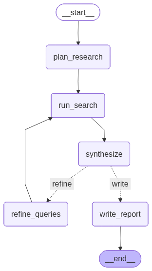
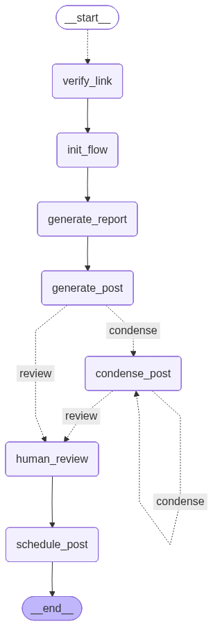
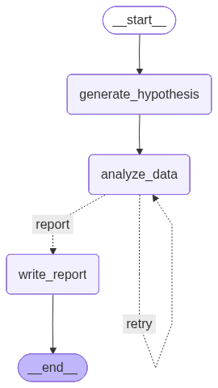

# langgraph_projects

سه پروژه‌ی آموزشی با [**LangGraph**](https://github.com/langchain-ai/langgraph) که هر کدام
نسخه‌ی ساده‌شده‌ای از یک پروژه‌ی open-source واقعی هستند. هدف، یادگیری «مدل‌سازی مسئله به‌صورت
گراف» است: چطور یک مسئله را به **State**، **نودها** و **یال‌ها** تبدیل کنیم.

| پروژه | الهام از | ایده‌ی اصلی |
|---|---|---|
| [`deep-research-agent`](./deep-research-agent) | [open_deep_research](https://github.com/langchain-ai/open_deep_research) | تحقیق چندمرحله‌ای با حلقه‌ی اصلاحی |
| [`social-media-agent`](./social-media-agent) | [social-media-agent](https://github.com/langchain-ai/social-media-agent) | تولید پست از روی لینک‌ها + تأیید انسانی |
| [`data-analysis-agent`](./data-analysis-agent) | [AI-Data-Analysis-MultiAgent](https://github.com/aimped-ai/ai-data-analysis-MultiAgent) | تحلیل داده‌ی چندایجنتی با اجرای کد |

---

## مدل‌سازی مسئله با LangGraph

قبل از پروژه‌ها، خوب است طرز فکر مشترکی که پشت هر سه‌تاست را روشن کنیم. در LangGraph هر مسئله
را به یک **گراف جهت‌دار** تبدیل می‌کنیم و چهار سؤال را جواب می‌دهیم:

1. **State چیست؟** — اطلاعاتی که در طول اجرا بین نودها جریان دارد. آن را با یک `TypedDict`
   تعریف می‌کنیم. برای فیلدهایی که باید *انباشته* شوند (نه بازنویسی)، از **reducer** استفاده می‌کنیم
   (مثل `operator.add` برای لیست‌ها یا `add_messages` برای پیام‌ها).

2. **نودها کدام‌اند؟** — هر گام منطقی یک تابع است که State فعلی را می‌گیرد و یک *به‌روزرسانی جزئی*
   از State برمی‌گرداند (یک `dict`). نودها معمولاً مدل را صدا می‌زنند یا یک ابزار را اجرا می‌کنند.

3. **یال‌ها چطور وصل می‌شوند؟** — یال‌های ساده مسیر ثابت‌اند. **یال‌های شرطی**
   (`add_conditional_edges`) بر اساس State تصمیم می‌گیرند کجا برویم — این‌جا جای **شاخه‌بندی**
   و **حلقه‌ها** است.

4. **چه الگوهای خاصی لازم است؟**
   - **حلقه (loop):** یک نود به نود قبلی برمی‌گردد تا یک شرط برقرار شود (مثلاً «تعداد تکرار <
     سقف» یا «پست هنوز بلند است»). برای جلوگیری از حلقه‌ی بی‌نهایت، همیشه یک شمارنده‌ی سقف داریم.
   - **اجرای موازی (`Send`):** یک ورودی را به چند شاخه‌ی هم‌زمان پخش می‌کنیم (map) و نتایج با
     reducer در State جمع می‌شوند (reduce).
   - **انسان در حلقه (`interrupt`):** اجرا را موقتاً متوقف می‌کنیم تا انسان تأیید/ویرایش کند،
     بعد با `Command(resume=...)` ادامه می‌دهیم.

این چهار سؤال، نقشه‌ی راه هر سه پروژه است.

---

## ساختار مشترک پروژه‌ها

هر پروژه ساختار یکسانی دارد (الگوی توصیه‌شده‌ی LangGraph برای deploy):

```
<project>/
├── my_agent/
│   ├── utils/
│   │   ├── __init__.py
│   │   ├── tools.py        # ابزارها (search, fetch, run_python, ...)
│   │   ├── nodes.py        # توابع نودها + توابع مسیریابی شرطی
│   │   └── state.py        # تعریف State و reducerها
│   ├── __init__.py
│   └── agent.py            # ساخت و کامپایل گراف (خروجی: متغیر `graph`)
├── display_graph.py        # رسم گراف به‌صورت تصویر Mermaid
├── .env.example            # نمونه‌ی متغیرهای محیطی
├── requirements.txt
├── langgraph.json          # تنظیمات deploy
└── README.md
```

---

## پیش‌نیازها و نصب

برای **هر** پروژه، از داخل پوشه‌اش (مثال با `deep-research-agent`):

```powershell
cd deep-research-agent

# 1) محیط مجازی
python -m venv .venv
.\.venv\Scripts\Activate.ps1

# 2) نصب نیازمندی‌ها
python -m pip install -r requirements.txt

# 3) تنظیم متغیرهای محیطی
Copy-Item .env.example .env
# سپس OPENAI_API_KEY (و در صورت نیاز TAVILY_API_KEY) را در .env پر کنید
```

> همه‌ی پروژه‌ها از `ChatOpenAI` استفاده می‌کنند و `base_url` را از `OPENAI_BASE_URL` می‌خوانند،
> پس می‌توانید هر endpoint سازگار با OpenAI را هم استفاده کنید.

### اجرا
```powershell
langgraph dev          # اجرای گراف با LangGraph Server + Studio
# یا رسم تصویر گراف:
python display_graph.py # فایل graph.png را می‌سازد
```

---

## پروژه ۱ — Deep Research Agent

**مسئله:** یک موضوع از کاربر می‌گیریم و یک گزارش پژوهشی منسجم تولید می‌کنیم.

**مدل‌سازی:** تحقیق یک کار «تک‌مرحله‌ای» نیست؛ پس آن را به چرخه‌ی *برنامه‌ریزی → جست‌وجو →
جمع‌بندی → اصلاح* تبدیل می‌کنیم. State نتایج جست‌وجو را با reducer **انباشته** می‌کند تا در هر
دور حلقه از بین نرود. یک یال شرطی بعد از `synthesize` تصمیم می‌گیرد که آیا برای پر کردن
شکاف‌ها دور دیگری بزنیم (`refine`) یا گزارش نهایی را بنویسیم (`write`). شمارنده‌ی
`iteration_count`/`max_iterations` جلوی حلقه‌ی بی‌پایان را می‌گیرد.

<p align="center"></p>

- **State:** `topic`, `research_plan`, `search_queries`, `search_results` (با reducer),
  `findings`, `final_report`, `iteration_count`, `max_iterations`
- **نودها:** `plan_research` → `run_search` → `synthesize` → (`refine_queries` → `run_search`)\* → `write_report`
- **ابزار:** `web_search` (Tavily)

---

## پروژه ۲ — Social Media Agent

**مسئله:** چند لینک می‌گیریم و یک پست کوتاه و آماده‌ی انتشار تولید می‌کنیم.

**مدل‌سازی:** چون لینک‌ها مستقل‌اند، آن‌ها را با **`Send`** به‌صورت **موازی** بررسی می‌کنیم
(الگوی map-reduce) و محتوای تأییدشده با reducer در State جمع می‌شود. تولید پست محدودیت طول دارد،
پس یک **حلقه‌ی کوتاه‌سازی** اضافه کرده‌ایم که تا ۳ بار پست را خلاصه می‌کند. در پایان، قبل از
انتشار، با **`interrupt()`** اجرا را متوقف می‌کنیم تا انسان پست را تأیید یا ویرایش کند — یک
نمونه‌ی واقعی از «انسان در حلقه».

<p align="center"></p>

- **State:** `links`, `verified_urls` (با reducer), `report`, `post`, `image_url`, `condense_count`
- **نودها:** `verify_link` (موازی) → `init_flow` → `generate_report` → `generate_post` →
  (`condense_post`)\* → `human_review` (interrupt) → `schedule_post`
- **ابزار:** `fetch_url` (دریافت و پاک‌سازی محتوای صفحه)
- **ادامه پس از توقف:** `app.invoke(Command(resume={}), config)` یا با پست ویرایش‌شده:
  `Command(resume={"post": "..."})`

---

## پروژه ۳ — Data Analysis Agent

**مسئله:** یک فایل CSV و یک سؤال تحلیلی می‌گیریم و گزارش تحلیل تولید می‌کنیم.

**مدل‌سازی:** کار را بین «نقش»های مختلف تقسیم می‌کنیم (الگوی چندایجنتی): یک نود **فرضیه**
می‌سازد، یک نود **کد pandas** می‌نویسد و با ابزار `run_python` اجرا می‌کند، و یک نود **گزارش**
می‌نویسد. چون کدِ تولیدشده ممکن است خطا بدهد، یک **حلقه‌ی خوداصلاحی** داریم: اگر اجرای کد خطا
داد، خطا به مدل برگردانده می‌شود تا کد را اصلاح کند (تا سقف `max_iterations`).

<p align="center"></p>

- **State:** `data_path`, `question`, `messages` (با `add_messages`), `hypothesis`,
  `analysis_code`, `analysis_result` (با reducer), `report`, `iteration_count`, `max_iterations`
- **نودها:** `generate_hypothesis` → `analyze_data` → (`analyze_data` در صورت خطا)\* → `write_report`
- **ابزار:** `run_python` (اجرای کد pandas روی DataFrame)

> ⚠️ `run_python` کدِ تولیدشده‌ی مدل را با `exec` اجرا می‌کند؛ فقط برای استفاده‌ی محلی و مطمئن.

---

## نمایش گراف

هر پروژه یک `display_graph.py` دارد که گراف را به تصویر **Mermaid** تبدیل می‌کند:

```powershell
python display_graph.py   # graph.png را می‌سازد و در Jupyter به‌صورت inline هم نشان می‌دهد
```

تصویر از طریق سرویس `mermaid.ink` رندر می‌شود، پس برای ساخت PNG به اینترنت نیاز است.
